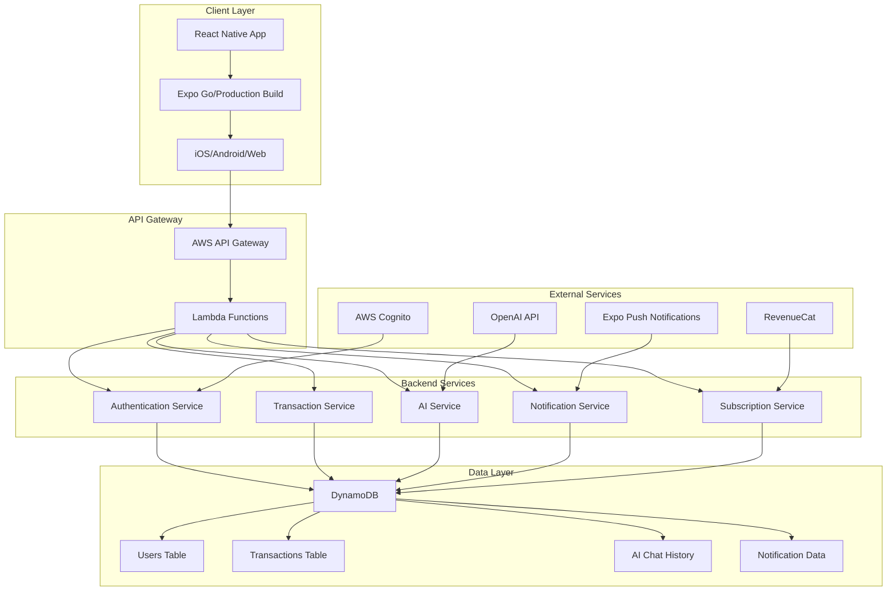

# Expenzez - AI-Powered Expense Tracking App

A comprehensive expense tracking application built with React Native and AWS serverless architecture, featuring AI-powered financial insights, budget management, and subscription-based premium features.

## 🚀 Quick Start

### Prerequisites

- Node.js 18+
- Expo CLI
- AWS CLI (for backend development)
- iOS Simulator or Android Emulator

### Frontend Setup

```bash
cd expenzez-frontend
npm install
npm start
```

### Backend Setup

```bash
cd expenzez-backend
npm install
npm run dev
```

## 🏗️ Architecture Overview

### System Architecture



## 🎯 Key Features

### Core Features

- **Manual Transaction Entry**: Add expenses with categories and descriptions
- **CSV Import**: Bulk import transactions from CSV files
- **AI-Powered Insights**: Get personalized financial advice and spending analysis
- **Budget Management**: Create and track spending budgets with alerts
- **Credit Score Tracking**: Monitor credit score changes
- **Push Notifications**: Real-time alerts for transactions and budget limits

### Premium Features

- **Advanced Analytics**: Detailed spending reports and trends
- **Unlimited AI Queries**: No daily limits on AI assistant
- **Unlimited Budgets**: Create unlimited budget categories
- **Priority Support**: Enhanced customer support

## 🛠️ Technology Stack

### Frontend

- **React Native**: 0.81.4 with Expo SDK 54
- **TypeScript**: Full type safety
- **Expo Router**: File-based routing
- **NativeWind**: Tailwind CSS for React Native
- **RevenueCat**: Subscription management
- **Expo Notifications**: Push notifications

### Backend

- **Node.js**: 18+ with TypeScript
- **Express.js**: Development server
- **AWS Lambda**: Serverless production deployment
- **AWS DynamoDB**: NoSQL database (11+ tables)
- **AWS Cognito**: Authentication
- **AWS SNS/SES**: Notifications and email
- **OpenAI API**: AI-powered insights

### Database Schema

- **Users**: User profiles and settings
- **Transactions**: Financial transactions
- **AIChatHistory**: AI conversation history
- **NotificationTokens**: Push notification tokens
- **UserBudgets**: Budget configurations
- **Cache**: API response caching

## 📱 Development

### Frontend Development

```bash
cd expenzez-frontend
npm start                    # Start Expo development server
npm run android             # Run on Android emulator
npm run ios                 # Run on iOS simulator
npm run web                 # Run in web browser
npm run lint                # Run ESLint
```

### Backend Development

```bash
cd expenzez-backend
npm run dev                 # Start development server
npm run build               # Compile TypeScript
npm start                   # Start production server
serverless deploy           # Deploy to AWS
serverless offline          # Run Lambda functions locally
```

## 🔐 Security

### Authentication

- AWS Cognito for user management
- JWT tokens with automatic refresh
- Biometric authentication (Face ID/Touch ID)
- PIN protection for app access

### Data Protection

- End-to-end encryption for sensitive data
- Secure token storage using SecureStore
- HTTPS for all API communications
- AWS IAM roles with least-privilege access

## 📊 Monitoring & Observability

### Logging

- CloudWatch logs for all Lambda functions
- Structured logging with correlation IDs
- Error tracking with Sentry integration

### Metrics

- API Gateway metrics and throttling
- Lambda performance and error rates
- DynamoDB read/write capacity monitoring
- Custom business metrics

## 🚀 Deployment

### Production Deployment

- **Frontend**: EAS Build for iOS/Android app stores
- **Backend**: Serverless Framework to AWS Lambda
- **Database**: DynamoDB with auto-scaling
- **Monitoring**: CloudWatch alarms and dashboards

### Environment Management

- Development, staging, and production environments
- Environment-specific configuration
- Secrets management with AWS Secrets Manager

## 📈 Performance

### Frontend Performance

- Optimized bundle size with Metro bundler
- Image optimization and lazy loading
- Efficient state management with React Context
- Offline-first architecture with caching

### Backend Performance

- Lambda cold start optimization
- DynamoDB query optimization
- API response caching
- Connection pooling and reuse

## 🧪 Testing

### Test Framework

- Jest for unit testing
- React Native Testing Library for component testing
- Automated test suite for Lambda functions
- Integration tests for API endpoints

## 📚 Documentation

- **Architecture Rating**: 9.1/10 (A+) - See `ARCHITECTURE_RATING.md`
- **Development Guidelines**: See `CLAUDE.md`
- **Business Model**: See `FREEMIUM_MODEL.md`
- **Email System**: See `EMAIL_PREFERENCES_SYSTEM.md`

## 🤝 Contributing

1. Fork the repository
2. Create a feature branch (`git checkout -b feature/amazing-feature`)
3. Commit your changes (`git commit -m 'Add amazing feature'`)
4. Push to the branch (`git push origin feature/amazing-feature`)
5. Open a Pull Request

## 📄 License

This project is proprietary software. All rights reserved.

## 🆘 Support

For support and questions:

- Check the documentation in this repository
- Review the development guidelines in `CLAUDE.md`
- Contact the development team

---

**Status**: Production-Ready Enterprise Architecture  
**Rating**: 9.1/10 (A+)  
**Last Updated**: October 2024
